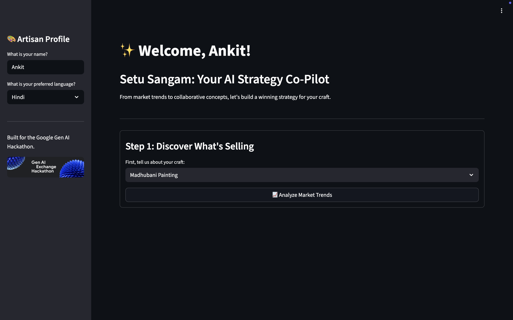

# Setu Sangam 🎨

An AI-powered strategic co-pilot designed to empower Indian artisans by connecting traditional craftsmanship with modern market trends.



**Live Demo:** https://setu-sangam-service-820216128666.asia-south1.run.app/

---

## The Problem

Indian artisans, keepers of immense cultural heritage, often operate in isolation from the fast-paced digital marketplace. They face significant challenges in understanding contemporary design trends, marketing their unique stories effectively, and finding innovative collaboration opportunities. This disconnect limits their economic growth and threatens the long-term sustainability of their invaluable crafts.

## Our Solution

**Setu Sangam** (from the Sanskrit for "The Confluence Bridge") is a generative AI tool that acts as a personal business strategist for every artisan. Our platform provides data-driven insights and creative tools to bridge the gap between tradition and commerce, transforming artistic passion into a thriving, modern enterprise.

## Core Features

* **AI Market Trend Analysis:** Generates concise, scannable reports on current market trends, colors, and consumer values relevant to a specific craft.
* **Trend-Driven Collaboration Matching:** Intelligently recommends synergistic partner crafts based on market data to spark innovative and commercially viable new product lines.
* **Full Concept Generation:** Creates detailed, multi-part business proposals for collaborative projects, including a strategic vision, product descriptions, and a go-to-market plan.
* **Multilingual & Accessible:** The entire interface, including AI-generated content, is translatable into several Indian languages and includes text-to-speech functionality.
* **Actionable Outreach Tools:** Generates ready-to-use, professional messages to help artisans initiate real-world conversations with potential collaborators.

## Tech Stack

* **Platform:** Python & Streamlit
* **AI & Cloud:** Google Cloud Run, Vertex AI (Gemini 2.5 Flash), Cloud Text-to-Speech
* **Containerization:** Docker

## Running the Project Locally

1.  **Clone the repository:**
    ```bash
    git clone [your-repo-url]
    cd setu_sangam
    ```

2.  **Create and activate a virtual environment:**
    ```bash
    python -m venv venv
    source venv/bin/activate
    ```

3.  **Install dependencies:**
    ```bash
    pip install -r requirements.txt
    ```

4.  **Set up credentials:**
    * Obtain the `google-credentials.json` and `.env` files.
    * Place them in the project's root directory.
    * Set the environment variable in your terminal:
        ```bash
        export GOOGLE_APPLICATION_CREDENTIALS="google-credentials.json"
        ```

5.  **Run the app:**
    ```bash
    python -m streamlit run app/main.py
    ```

---
*Built with ❤️ for the Google Gen AI Hackathon.*
